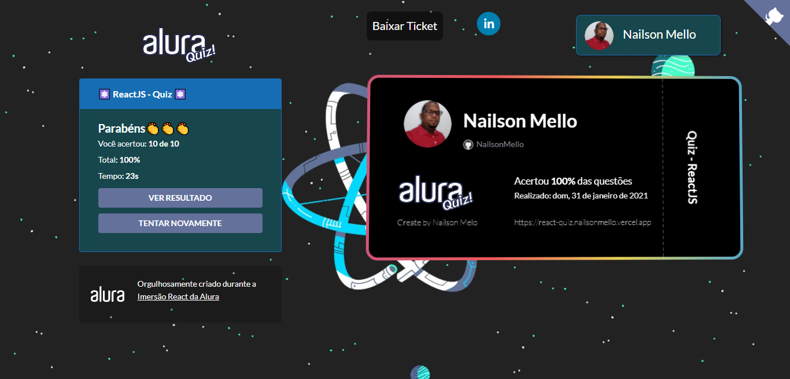

# Project developed during Alura's react immersion.

### What was used for implementation?

* ReactJS ⚛️
* NextJS
* NodeJS
* MongoDB
* Puppeteer Core
* Framer Motion

## Basic Setup

To run demo: clone repo and run `npm install || yarn install && npm run dev || yarn dev`
and open `http://localhost:3000`.

## Click to see the video on YouTube

## Screens
| | | |
|:-------------------------:|:-------------------------:|:-------------------------:|
|  Login |   Home| Quiz|
| Result |   Answers| Ticket|

## Screens mobile
| | | |
|:-------------------------:|:-------------------------:|:-------------------------:|
|  Mobile|

### Want to test your knowledge of ReactJS?

### Access now: [ReactQuiz](https://react-quiz.nailsonmello.vercel.app/)

